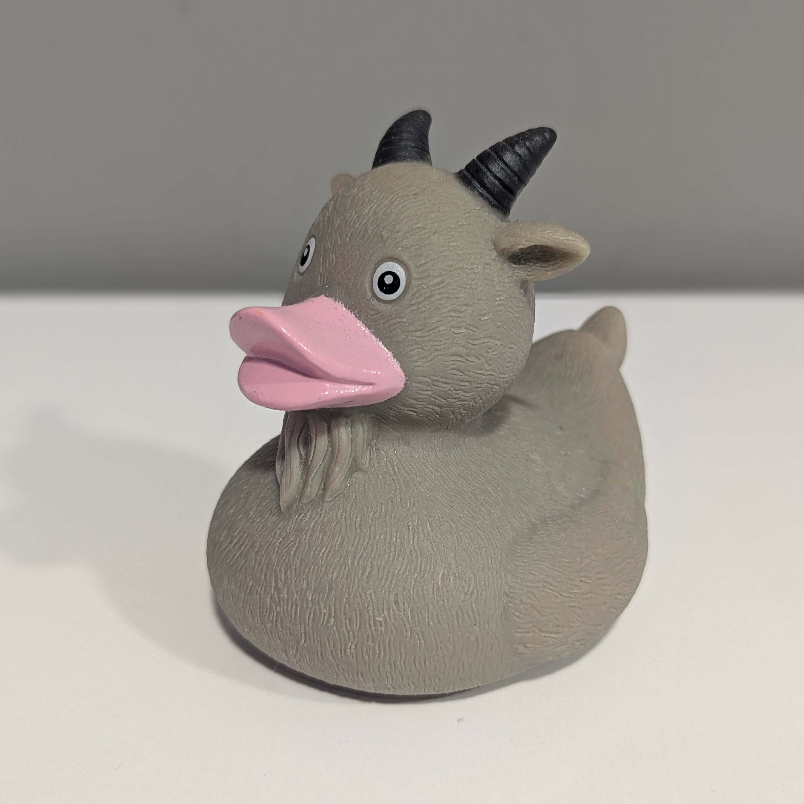

# Ducktility

[](https://ocaml.org/releases/ocaml-5.4.html)

<div align="center">
  
</div>

**Ducktility** is a lightweight, high-performance, in-memory Time-Series Database (TSDB) metrics engine written in OCaml.

Ducktility decouples temporal window tracking and mathematical data aggregation from the core ingestion loop. By utilizing functors, the engine remains completely agnostic to how time is partitioned or how data is summarized, allowing anyone to plug in custom strategies at compile time without modifying the underlying systems logic.

The name **Ducktility** is a functional-programming spin on **ductility** - the physical property of a material to deform, stretch, and adapt under tensile stress without fracturing.

This mirrors the core design philosophy of the project:

* **Ductility:** The engine's architecture is highly flexible. Its module boundaries easily stretch to accommodate any data types, sliding or tumbling time windows, and mathematical aggregates without breaking the system constraints.
* **Duck:** A nod to the rubber duck debugging companion.


## Core Architecture

Ducktility coordinates high-frequency data ingestion through strict module signatures:

* `TIME_WINDOW`: Dictates the temporal boundaries and bucket lifespan.
* `AGGREGATOR`: Encapsulates the internal running accumulator state and final downsampling calculations.
* `MakeMetricsEngine`: The core functor that stitches them together to manage stateful history and active windows.


## Setup Instructions

### 1. Install OPAM

If you don't have the OCaml package manager yet, grab it here:

```bash
sh <(curl -sL https://raw.githubusercontent.com/ocaml/opam/master/shell/install.sh)

```

### 2. Initialize OCaml 5.4.1

I'm using a dedicated "switch" for this project to keep the OCaml 5.4 environment clean.

```bash
opam init -y
opam switch create ducktility 5.4.1
eval $(opam env --switch=ducktility)

```

### 3. Install Project Libraries

I need **Dune** to build the project:

```bash
opam install -y dune

```
